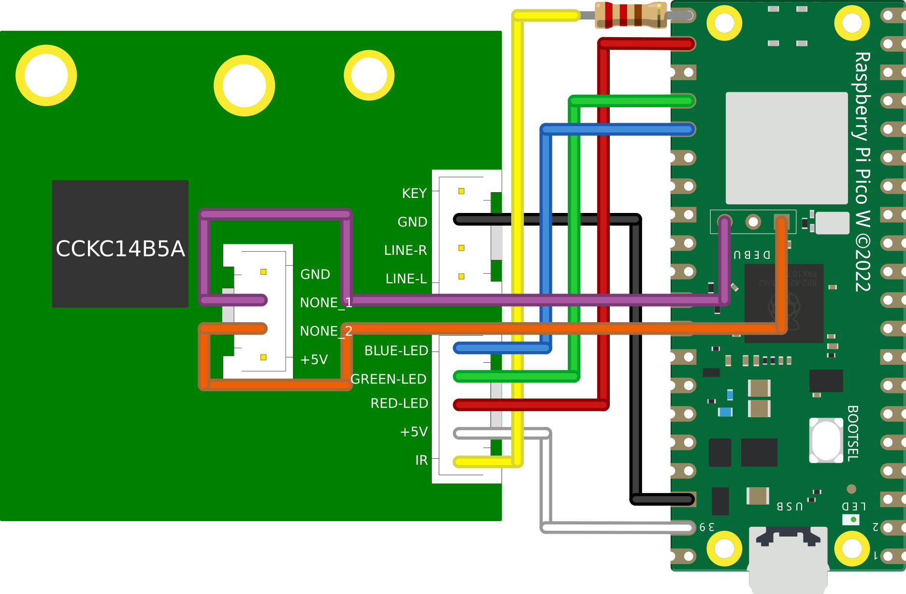

# Snowdon II WiFi 

A hardware hack for the [MAJORITY Snowdon II Sound bar](https://www.majority.co.uk/soundbars/snowdon/) that adds WiFi capabilities, essentially transforming it into an IoT device.

Full writeup available over on the [blog post](https://kennedn.comblog/posts/snowdon/).

## Wiring

> `SWDIO` and `SWCLK` are not required for normal operations, they expose the SWD debug pins on the unused USB header for easy access
<table style="width:100%; margin-left: auto; margin-right: auto">
<tr><td style="width:30%; padding: 1px;">


</td>
<td style="width:70%; padding 1px;">
    
</tr>
</table>

<p align="center">
    
    
</p>
<p align="center">
    
    
</p>

## Compiling Guide

> Please refer to the offical [Getting Started](https://datasheets.raspberrypi.com/pico/getting-started-with-pico.pdf) guide for full details on getting a build environment setup

Due to the final software containing hardcoded WiFi credentials, it's impossible to share a pre-built `uf2`. So we must install the Pico SDK and built it from scratch.

<br/>

Install dependencies for SDK:
```bash
sudo apt update
sudo apt install git cmake gcc-arm-none-eabi libnewlib-arm-none-eabi build-essential
```

Clone SDK;
```bash
cd ~/
git clone https://github.com/raspberrypi/pico-sdk.git
cd pico-sdk
git submodule update --init
```

Export PICO_SDK_PATH variable:
```bash
export PICO_SDK_PATH=$HOME/pico-sdk
```

Clone Snowdon-II-WiFi:
```bash
git clone https://github.com/kennedn/snowdon-ii-wifi.git
```

Create a build directory and configure `cmake` with WiFi credentials:
```bash
cd snowdon-ii-wifi
mkdir build
cd build
# Replace <SSID> and <PASSWORD> with own values
cmake -DPICO_BOARD=pico_w -DWIFI_SSID="<SSID>" -DWIFI_PASSWORD="<PASSWORD>" ..
```

Compile the program:
```bash
cd src
make
```

<br/>

If all goes well, a file named `snowdon.uf2` should now exist under `~/snowdon-ii-wifi/build/src/`. 

<br/>

The Pico can now be plugged in via USB whilst holding down the `BOOTSEL` button, and the `uf2` file dropped in the volume mount.

## API

The RESTful API is exposed on port 8080:

`http://<ip_address>:8080`

<br/>

The endpoint expects a single `code` parameter, which can be sent via either url encoding or in the JSON body of the request, e.g:

```bash
curl -X PUT http://192.168.1.238:8080?code=status
# or
curl -X PUT http://192.168.1.238:8080 -H 'Content-Type: application/json' -d '{"code": "power"}'
```

<br/>

And this is the full list of available code values:

|Value | Description| JSON response |
|------|------------|---------------|
|power|Infrared Code|`{"status": "ok"}`|
|input|Infrared Code|`{"status": "ok"}`|
|mute|Infrared Code|`{"status": "ok"}`|
|volume_up|Infrared Code|`{"status": "ok"}`|
|volume_down|Infrared Code|`{"status": "ok"}`|
|previous|Infrared Code|`{"status": "ok"}`|
|next|Infrared Code|`{"status": "ok"}`|
|play_pause|Infrared Code|`{"status": "ok"}`|
|treble_up|Infrared Code|`{"status": "ok"}`|
|treble_down|Infrared Code|`{"status": "ok"}`|
|bass_up|Infrared Code|`{"status": "ok"}`|
|bass_down|Infrared Code|`{"status": "ok"}`|
|pair|Infrared Code|`{"status": "ok"}`|
|flat|Infrared Code|`{"status": "ok"}`|
|music|Infrared Code|`{"status": "ok"}`|
|dialog|Infrared Code|`{"status": "ok"}`|
|movie|Infrared Code|`{"status": "ok"}`|
|status|RGB LED Query|`{"onoff": power_state, "input": input_state}`|

<br/>

`power_state` has the following possible values:
|Value|
|-----|
|on   |
|off  |

<br/>

`input_state` has the following possible values:
|Value|
|-----|
|off  |
|optical|
|aux|
|line-in|
|bluetooth|